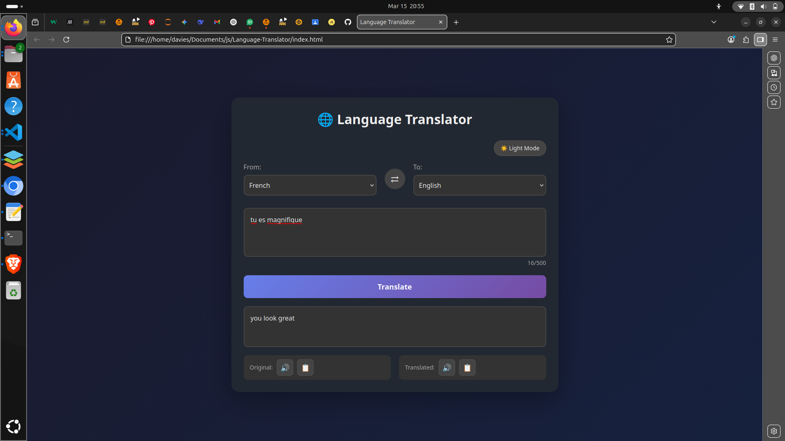

# Language Translator 🌍

A web-based language translator built with vanilla JavaScript.

## Features
- Clean, modern interface
- Real-time translation
- Multiple language support

## Built With
- HTML5
- CSS3
- JavaScript

## Screenshot

What I Learned
- DOM manipulation
- Event handling
- JavaScript objects for dictionaries
- CSS styling

 Future Improvements

Future Improvements
- Add more languages
- Voice input
- Translation history

 
⭐ Star this repo if you like it!
