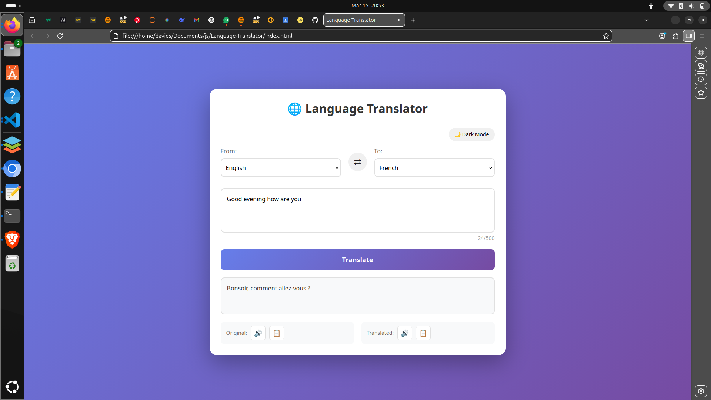

Language Translator 🌍

A web-based language translator built with vanilla JavaScript.

Features
- Clean, modern interface
- Real-time translation
- Translates words between langueges

Built With
- HTML5
- CSS3
- JavaScript
- 
What I Learned
- DOM manipulation
- Event handling
- JavaScript objects for dictionaries
- CSS styling

Future Improvements
- Add more languages
- Voice input
- Translation history

Screenshots

  

⭐ Star this repo if you like it!
